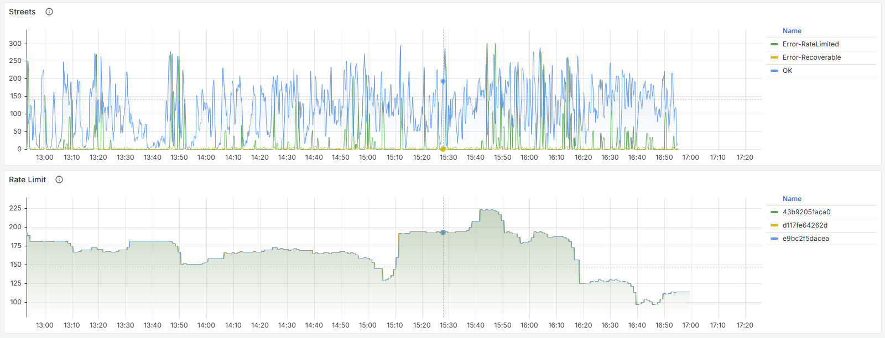
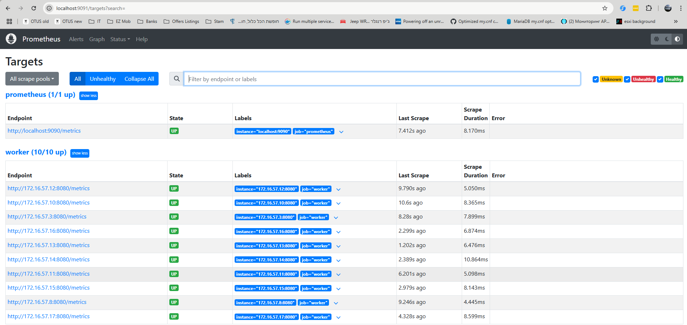
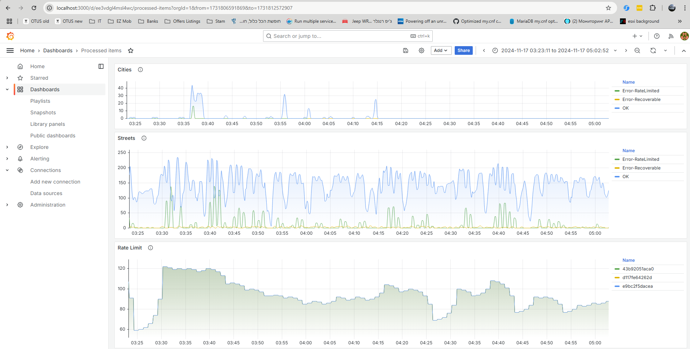
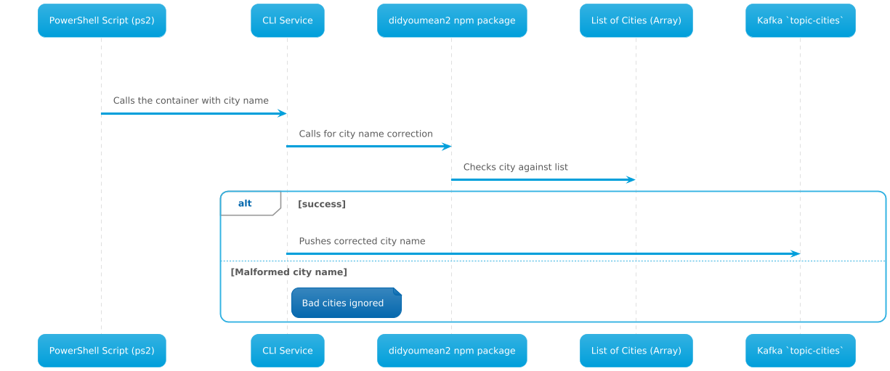
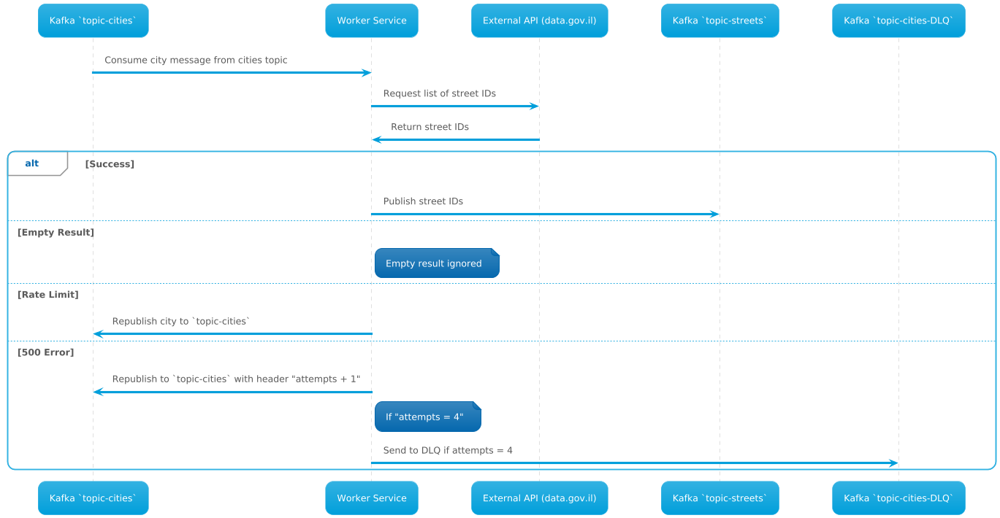
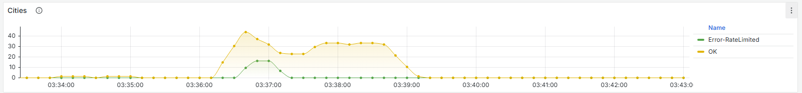
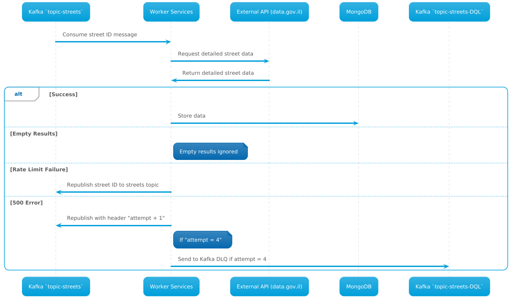
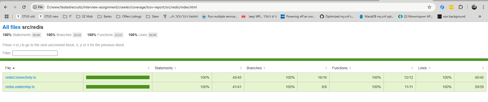

# Services Overview

## 1. `cli` Service
**Purpose**: The `cli` service is a Dockerized command-line interface that allows users to input a city name. It then pushes the requested city into a dedicated Kafka topic (`topic-cities`), enabling the `worker` services to process the data asynchronously.

**Functionality**:
- Accepts user input for city names.
- Publishes city names to the Kafka `topic-cities` topic.
- Handles potential rate limiting by deferring requests to the Kafka queue, ensuring retries and eventual consistency.
- The city names stored in the npm package are used as "correct spelling" of the city name to improve UX of the operator, as typing in a wrong city name will result in a bad response from the API. It may be, however, that the list of city names includes errors, and it would be best to confirm this against the API (a side quest outside the scope).
- Uses the npm package **"didyoumean2"** for correcting city names, improving the user experience by preventing incorrect API responses.

## 2. `worker` Service
**Purpose**: The `worker` service listens to Kafka topics (`topic-cities` and `topic-streets`), processes messages, interacts with external APIs, and stores data in MongoDB. It also handles dynamic rate limiting, leader election, and inter-service communication.

**Functionality**:
- Consumes messages from Kafka topics (`topic-cities`, `topic-streets`).
- Acts according to the origin topic:
  - If from `topic-cities`, requests street IDs from an external API.
  - If from `topic-streets`, requests detailed street data.
- Implements dynamic throttling to comply with the external API's rate limits.
- Stores successful data responses in MongoDB.
- Implements retry mechanisms and dead-letter queues for failed messages.
- Participates in leader election using Redis to coordinate rate limit adjustments (during init also creates topics).
- To handle the data.gov.il clock drift (approximately 5 seconds), the service issues a reflection of statistics on the 10th second, which is statically configured through the `.env` file. This mechanism helps prevent unnecessary lowering of the rate limit.
- The rate adjustment feature uses exponential rate limit modification based on observed trends and multiplication factors, all of which are configurable via the `.env` file.

*Because linear rate limit modifications take too long to reach the desired state, exponential adjustments have been implemented, although this method may also have its own limitations.*



*As a potential side project, an optional adjustment strategy has been formulated: continuously increase the rate until rate limits are encountered, at which point decrement by the number of rate-limited responses. This approach would require comparing the time taken by successful responses to the time taken by rate-limited ones. To achieve this, all response times would need to be measured and an appropriate ratio calculated to adjust the decrement amount. Due to the complexity and time required for implementation, this feature is considered out of scope.*

## Infrastructure

### Redis Standalone Container
A standalone Redis container has been included in the infrastructure and serves multiple purposes:

- Stores global counters for the rate limiter feature, ensuring continuity during leader transitions.
- Manages leader election processes.
- Facilitates broadcasting rate update messages to `worker` instances.

### Prometheus
A pre-configured Prometheus was implemented.

- Automatically collect metrics from all `worker` replicas
- Enabling effective monitoring and observability.

available on http://localhost:9091



### Grafana
A pre-configured Grafana dashboard has been implemented, featuring three primary visualizations:

- City request metrics, including counts for successful, rate-limited, and error responses.
- Street request metrics, showing counts for successful, rate-limited, and error responses.
- The current rate limit level, providing insight into system adjustments and performance.

available on http://localhost:3000
- **credentials:** admin / very-secret (configurable via `.env`)



### Health Checks
- All newly added services are equipped with Docker health check features to ensure they are functioning properly and can be monitored effectively.

## Architecture and Data Flow

### Microservices Architecture
- The system is composed of microservices (`cli` and multiple `worker` instances) running in Docker containers.
- **Kafka (Redpanda)** is used as the message broker for inter-service communication.
- **Redis** is used for leader election, rate limit storage, and inter-service messaging via Pub/Sub.
- **MongoDB** serves as the primary data store for storing the processed data.
- **Grafana and Prometheus** are used for monitoring and visualization.

### Data Flow
**City Request**:
1. The `cli` service publishes a city name to the `topic-cities` Kafka topic.

2. `worker` services consume messages from the `topic-cities` topic.
3. Upon receiving a city name, a `worker` requests the list of street IDs from the external API.
4. Street IDs are published to the `topic-streets` Kafka topic.



*It is important to traverse the cities requests via topic with a retry policy, since if the system is under load, the city request may be throttled by the rate limit of data.gov.il.*



*Example of `cli` command usage:*
```powershell
PS D:\www\interview-assignment> .\cli.ps1 --cities "tel aviv jaffo" "jerusalem" "ashdod" "ashkelon" "haifa" "maale adumim"
Processing city: tel aviv jaffo
Auto corrected the city name: [Tel Aviv Jaffa]
Processing city: jerusalem
Auto corrected the city name: [Jerusalem]
Processing city: ashdod
Auto corrected the city name: [Ashdod]
Processing city: ashkelon
Auto corrected the city name: [Ashkelon]
Processing city: haifa
Auto corrected the city name: [Haifa]
Processing city: maale adumim
Auto corrected the city name: [Ma'ale Adumim]
PS D:\www\interview-assignment>
```

**Street Data Processing**:
1. `worker` services consume messages from the `topic-streets` topic.
2. For each street ID, a `worker` requests detailed street data from the external API.
3. Successful responses are stored in MongoDB.
4. Failures are retried up to 3 times; persistent failures are sent to a dead-letter queue (DLQ).



### Rate Limiting and Throttling
- The external API employs a dynamic rate limit using a Fixed Window algorithm.
- One `worker` instance is elected as the leader using Redis.
- The leader collects success/failure statistics from Redis and adjusts the rate limit every 60 seconds.
- The updated rate limit is broadcasted to all `worker` instances via Redis Pub/Sub.
- Each `worker` adjusts its request rate accordingly, ensuring compliance with the external API's rate limits.

## Leader Election and Coordination
**Implementation**:
- Leader election is managed through Redis, where one `worker` instance assumes the role of leader.
- The leader is responsible for creating Kafka topics and setting the partitions to 30, aligning with the maximum estimated number of `worker` replicas for the POC.
- Non-leader instances wait during this step for a period defined by `KAFKA_TOPIC_CREATION_WAIT_SECONDS`, which is configurable via the `.env` file.
- The leader evaluates rate limit adjustments and communicates these changes via Redis Pub/Sub.
- If the leader fails or shuts down, another `worker` is elected to maintain system stability.

*Verifying that topics are created with the intended number of partitions is crucial. By default, Kafka creates a topic with a single partition when a consumer connects, which would result in only one `worker` actively querying the external API.*


## Technologies and Tools Used

### Programming Languages and Frameworks
- **Node.js (v16.x)** and **TypeScript (v4.x)**: Used for developing both services, providing type safety and modern JavaScript features.
- **Express.js**: Used in the `worker` service to expose Prometheus metrics.

### Packages and Libraries
- **kafkajs**: A Kafka client for Node.js, used for seamless interaction with Redpanda.
- **ioredis**: A Redis client for Node.js, facilitating leader election, rate limit storage, and Pub/Sub messaging.
- **mongodb**: The MongoDB driver for Node.js, providing a connection to the data store.
- **prom-client**: A library for collecting and exposing metrics to Prometheus.
- **winston**: A robust logging library configured for JSON output to ensure consistent and structured logs.
- **bottleneck**: Initially used as redis based system wide for rate limiting but was later limited to single worker instance as it cannot work with authentication and limiting by memory based instance is less resource hungry.
- **didyoumean2**: A package used in the `cli` service for correcting user-input city names to enhance user experience and prevent incorrect API responses.

### Infrastructure Services
- **Kafka (Redpanda)**: Message broker for decoupling services and enabling asynchronous communication.
- **Redis**: Used for leader election, distributed rate limiting, and Pub/Sub messaging.
- **MongoDB**: Primary data store for processed street data.
- **Grafana and Prometheus**: Used for monitoring system metrics and visualizing performance.

## Containerization and Deployment
**Docker and Docker Compose**:
  - Services are containerized with custom Dockerfiles.
  - Docker Compose manages multi-container deployment.

**Custom Dockerfiles Created for:**
  - `cli`
  - `worker`
  - Grafana
  - Redis
  - Prometheus

to include necessary configurations, healthcheck and dependencies.

## Key Features and Implementations

### 1. Dynamic Rate Limiting and Throttling
**Challenge**:

- The external API (data.gov.il) has a dynamic rate limit and applies a Fixed Window algorithm. Their system clock lags by approximately 5 seconds.

**Solution**:

- Implemented a custom distributed rate limiter using Redis to coordinate between `worker` instances.
- The leader collects request statistics and adjusts the rate limit every 60 seconds.
- Workers adjust their throttling based on the leader's instructions, preventing overloading of the API.
- To handle clock drift, the `worker` service issues a reflection of statistics on the 10th second, configurable via the `.env` file.

### 2. Leader Election and Coordination
**Implementation**:

- Used Redis-based leader election for high availability.
- The leader communicates rate limit changes via Redis Pub/Sub.
- If the leader fails, another `worker` is elected to ensure continuity.

### 3. Exponential Rate Limit Adjustment
**Implementation**:

- The rate adjustment feature in `worker` uses exponential rate limit modification based on trends and multiplication factors. This is configurable through the `.env` file to allow dynamic tuning based on system behavior.

### 4. Graceful Shutdown
**Challenge**:

- Ensuring that services disconnect from resources without data loss during shutdown.

**Solution**:

- Implemented a graceful shutdown mechanism with a Promise-based approach.
- Handled synchronous cascade style disconnection tasks with global timeout.

### 5. Logging with Winston and KafkaJS Integration
**Implementation**:

- Configured Winston for JSON log output.
- Integrated KafkaJS logging with Winston for uniform log levels and formatting.

### 6. Metrics and Monitoring
**Implementation**:

- Exposed metrics via `/metrics` using `prom-client`.
- Grafana dashboards visualize metrics such as request rates, success counts, and rate limit adjustments.

### 7. Retry Mechanism and Dead-Letter Queue
**Implementation**:

- Messages are retried up to 3 times; persistent failures are moved to the DLQ.
- Rate limit errors do not count towards retry limits.

### 8. Leader's Rate Limit Evaluation
**Process**:

- The leader evaluates the success to rate-limited response ratio every 60 seconds.
- Adjusts the rate limit and broadcasts it to workers via Redis Pub/Sub.

### 9. Configuration Management
**Implementation**:

- `.env` files manage environment variables.
- A central `config.ts` module ensures consistent configuration access.

## Challenges Faced and Solutions

### 1. Rate Limiting Complexity
**Issue**:

- Reviewed rate limiting libraries were inadequate for a distributed setup.
- I do believe there are a good ones in the wild ... Just did not found them the other day.

**Solution**:

- Developed a custom solution with Redis for synchronization and dynamic adjustments.

### 2. Logging and TypeScript Integration
**Issue**:

- KafkaJS and Winston integration led to TypeScript errors, and extra noise in logs.
 
**Solution**:

- Created a custom log function and resolved type errors with explicit annotations.

### 3. Graceful Shutdown with Global Timeout
**Issue**:

- Ensuring sequential shutdowns within a set time limit.

**Solution**:

- Implemented sequential disconnection tasks with bounded timeout.

### 4. Handling External API Limitations
**Issue**:

- The external API's dynamic rate limit and 5-second clock lag.

**Solution**:

- Adjusted rate evaluations to align with the system clock and prevent penalties from persisting into subsequent cycles.

## Deployment and Configuration

### Docker and Docker Compose
**Containerization**:

- Containerized services with custom Dockerfiles.

**Docker Compose**:

- Orchestrated services using `docker-compose.yml` with dependencies like Redis, MongoDB, and Prometheus.

### Customizations
**Grafana and Prometheus**:

- Custom images with pre-configured dashboards, healthcheck and configuration.

**Redis Security**:
 
- Implemented authentication for Redis.

## Logging and Monitoring

### Logging with Winston
**Configuration**:

- JSON logs to stdout.
- Integrated KafkaJS logs for consistent formatting.

### Monitoring with Grafana and Prometheus
**Metrics Collection**:

- Exposed metrics via `/metrics` for Prometheus scraping.

**Visualization**:

- Grafana dashboards for real-time system monitoring.

## Testing and Validation
**Testing**:

- Unit tests have been created, covering two files related to leadership and Redis connectivity.
- These tests achieve 100% line and branch coverage, representing a thorough approach to testing and reflecting the entire code.
- While this level of coverage considered excessive, it demonstrates a commitment to comprehensive testing.
- It is noted that testing could potentially be limited to the final outcomes of each method for a more streamlined approach.
- Validation of user input implemented, incorrect city names will be autocorrected.

**Observations**:

- Validated rate limit adjustments and retry mechanisms.
- Confirmed leader election stability.



## Security Considerations
**Redis Authentication**:

- Used user/password authentication.

**Credentials Management**:

- Acknowledged potential improvements with secrets management in production.

## Performance Optimizations

### Asynchronous Processing
- Leveraged Node.js non-blocking I/O for high performance.

### Custom Rate Limiter
- Developed to minimize overhead and synchronize workers effectively.

### Dynamic Throttling
- Real-time rate adjustments based on performance metrics.
